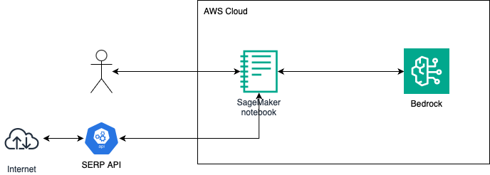

# Quickly and Factually Generating Company Summaries via Generative AI

In today's fast-paced world, staying informed about companies and their activities is crucial for investors, analysts, and professionals across various industries. However, with the ever-increasing volume of information available, keeping up can feel like a Herculean task.  Generative artificial intelligence (AI) can help.

Generative AI, particularly in the realm of natural language (large language models, LLMs), has improved considerably in recent years. It's not just about understanding language anymore; it's about generating it—creating human-like text that is coherent, contextually relevant, and, most importantly, informative.

## Large Language Models and Accuracy

While LLMs are strikingly creative, they still struggle to generate accurate and factual responses. This is because the core part of the pre-training process is typically next token prediction. LLMs are optimized to generate tokens that fit the distribution of their training data—and they do this very well—but they don’t have a world model to ensure that their responses are grounded in reality.  This is a well known problem and many techniques have been developed to better ground LLMs in reality:

* As part of the pre-training process, the model’s weights are adjusted to better align the model with reality. Techniques commonly used here include [Reinforcment Learning from Human Feedback](https://aws.amazon.com/what-is/reinforcement-learning-from-human-feedback/) (RLHF) and [Constitutional AI](https://www.anthropic.com/news/claudes-constitution).
* A model can be fine-tuned on additional data not included in the pre-training process. This is often used to improve a model’s performance on a specific domain.
* [Retrieval-Augmented Generation](https://aws.amazon.com/what-is/retrieval-augmented-generation/) (RAG) is a broad set of techniques that are used to extract relevant information from external sources and to incorporate those into the LLM’s response.
* There are many [prompt-engineering](https://en.wikipedia.org/wiki/Prompt_engineering) techniques, such as [Chain-of-Thought prompting](https://arxiv.org/pdf/2201.11903.pdf), that can help the LLM produce more factual and accurate answers.
* The [ReAct framework](https://arxiv.org/pdf/2210.03629.pdf), also known as the use of [Agents](https://aws.amazon.com/bedrock/agents/), is a way to use an LLM to plan how to break a question down into smaller questions, answer those questions from external sources, and then synthesize a response to the original question.

In this repo we demonstrate an approach that helps LLMs generate more accurate and factual responses. This approach is a variant of RAG where the retrieval mechanism is a web search. We call this Web Search-Augmented Generation (WSAG). This has four main advantages: 

* There is no need to setup a vector database (DB) ahead of time, which can take many hours, WSAG can generate responses immediately. 
* Vector DBs are static, they will quickly become stale unless a separate process is used to update them. Web search companies already spend a considerable amount of effort keeping their web indices up-to-date and we can piggy back off of that.
* Web searches can either search a particular web site, or they can use the entire web. With a vector DB you have to decide upfront what web sites to crawl and index. Building a vector DB of a large company’s web site, or multiple web sites, can be slow and expensive.
* WSAG provides more ways to optimize results. With standard RAG the retrieval mechanism is driven by the vector similarity between the embedding of the question and the embeddings of the documents (or “chunks”) in the corpus. As we will see later, the WSAG approach provides more ways of tuning the retrieval mechanism to optimize a particular use case.

## Generating Company Summaries Quickly and Factually

Consider, by way of example, a business development person in a large company that is evaluating many small companies for potential partnerships or acquisitions. There are many thousands of possible companies to consider and there is not enough time or money to investigate each company in depth. Instead, we use a funnel where we compute a quick and cheap summary for a large number of companies and then a human selects a smaller subset of these companies for a more in-depth investigation. Such a quick and cheap summary could include information like

* What is the company’s name?
* What is their mission, their purpose?
* What are their top products? 
* What is their product strategy?
* Who is on the leadership team?
* Are they private or public?
* What are some recent interesting press releases?
* If this is a biopharma then what are some recent scientific posters?

Manually generating this summary would likely take multiple person-days. We show in this repo how to use Generative AI to produce such a summary quickly (ideally in less than 30 minutes), accurately, and with no human intervention.

## Web Search-Augmented Generation

The standard RAG procedure uses an embedding model to questions and documents (or parts of documents, chunks) into embedding vectors and then uses vector similarity (e.g., cosine similarity) to determine the _k_ chunks that are most similar to the question. These _k_ chunks are then included in a prompt that asks the LLM to summarize the chunks:

```python
def RAG_setup(corpus: Set[Document], embedding_model):
    vector_db ← VectorDB()
    for document in corpus: # in practice these would be chunks
        embedding ← embedding_model(document)
        vector_db.add(embedding, document)
    return vector_db

# The VectorDB must be built, via RAG_setup(), before 
# we can process any queries:
embedding_model ← ... # for example, Titan Embeddings G1 – Text
vector_db ← RAG_setup(corpus, embedding_model)

def RAG_process_query(query: str,
                      summarization_model,
                      embedding_model,
                      k: int, # how many results to get from the vector DB
                      vector_db: VectorDB) → str:
    q_embedding ← embedding_model(query)
    top_results ← vector_db.lookup(q_embedding, k)
    # A very simple prompt, just to illustrate the idea:
    prompt = f"""
        Please summarize the following documents:
        {top_results}
        """
    return summarization_model(prompt)
```

With WSAG there is no need to create a vector DB, as the web search engine is effectively a (very large) vector DB. There are two flavors of WSAG: _map-reduce WSAG_ and _first-hit WSAG_. We will first describe map-reduce WSAG and later describe first-hit WSAG

## The map-reduce flavor of WSAG

In the map-reduce style of WSAG we first do a web search, we then download each organic search result, and then _map_ each downloaded document into a _map result_. We then _reduce_ the set of _map results_ into a final result:

```python
def WSAG_map_reduce(web_search_query: str,
                    web_searcher,
                    mapper, reducer) → str:
    search_results ← web_searcher(web_search_query)
    map_results ← [mapper(result) for result in search_results]
    return reducer(map_results)
```

To make this more concrete, imagine that we would like to produce a summary of a company’s product strategy:

```python
def product_strategy(company_name: str,
                     company_TLD: str, # top-level domain of this company
                     llm) → str:
    def mapper(search_result: dict) -> str:
        document ← ...download the link in the search result...
        prompt = f"""
            Given the following document, describe {company_name}'s
            product strategy:
            {document}
            """
        return llm(prompt)
        
    def reducer(map_results: List[str]) -> str:
        prompt = f"""
            Summarize the following documents:
            {map_results}
            """
        return llm(prompt)
        
    return WSAG_map_reduce(web_search_query=f"product strategy site:{company_TLD}",
                           web_searcher=...,
                           mapper=mapper,
                           reducer=reducer)
```

Note that when designing this solution we had at least the following possibilities for optimization:

* What is the query to the web search engine? Here we chose “product strategy”.
* What is the scope of the web search? Here we chose to only search the company’s web site. However, we could also try searching the entire web with a query like “product strategy {company_name}”.
* What pages should be considered? For example, we could only consider HTML pages or only PDFs, or only single-page PDFs.
* How should each page be processed? Here we use an LLM to describe the page, but there are many other choices.
* How should the final result be created? Here we create a summary of the map results, but there might be other approaches that would work better for this use case.

In summary, we can see that the map-reduce style of WSAG is a fast and flexible way of doing RAG.

## The first-hit flavor of WSAG

The second flavor of WSAG is useful when we just want to find a single web page that contains the result. This can be a useful way of reducing confabulations (also known as hallucinations). As an example, consider generating a description of a particular member, e.g., the CEO of a company’s leadership team. We propose here to do a web search and then, if possible, find the top hit that is from the company’s web site. If that isn’t possible then we can broaden our search to other web pages (not shown in the code below). First, here is the general structure of a first-hit WSAG:

```python
def WSAG_first_hit(web_search_query: str,
                   web_searcher,
                   filter, mapper, reducer) → str:
    search_results ← web_searcher(web_search_query)
    for search_result in search_results:
        if filter(search_result):
            map_result <- mapper(search_result)
            if map_result:
                return map_result
    return "unknown"
```

Unlike the map-reduce flavor we have only a mapper, no reducer, as we generate just one map result. We use the `filter` to decide if a search result satisfies this use case. To be concrete, we can revisit our use case of generating a summary of a member of the leadership team:

```python
def leadership_team(company_name: str,
                    company_TLD: str, # top-level domain of this company
                    job_role: str, # e.g. "Chief Executive Officer"
                    llm) → str:
    def mapper(search_result: dict) -> str:
        document ← ...download the link in the search result...
        prompt = f"""
            Given the following document, tell me more about
            the {job_role} at {company_name}:
            {document}
            If you can't tell from this document, return "unknown".
            """
        response <- llm(prompt)
        if response == "unknown":
            return None
        else:
            return response
        
    def filter(search_result: dict) -> str:
        """ Filter out everything but results from the 
            company's web site. """
        return TLD(search_result.link) == company_TLD
    
    # For now, the logic is simple. We could add the ability
    # to look at other web sites if we don't find a result on
    # the company's web site.
    return WSAG_first_hit(web_search_query=f"{job_role} {company_name}",
                          web_searcher=...,
                          mapper=mapper, filter=filter)
```

In summary, the first-hit flavor of WSAG is useful where we believe that we can quickly find a single web page that satisfies our request and the map-reduce flavor would be wasteful by downloading many web pages.

## Solution Overview

The specific problem we address in this repo is the quick, cheap and accurate generation of a summary for a company. The following diagram illustrates the workflow:



The user interacts directly with a [Jupyter notebook](./generate-company-summary.ipynb), this notebook user [SerpApi](https://serpapi.com/) to abstract away the details of interacting with search engines (in this case we use Google, but it could be any web search engine). It also uses [Amazon Bedrock](https://aws.amazon.com/bedrock/) models to analyze the text that is returned from SerpApi. The user provides the URL of the company’s website and the result is an HTML file that contains the summary.

## Prerequisites

The summaries are generated by a Jupyter notebook and requires that the following be installed first:

1. Install pyenv, this lets you install multiple Python interpreters. Follow [these instructions](https://github.com/pyenv/pyenv?tab=readme-ov-file#installation).

2. Using pyenv, install Python 3.10.9. Other Python versions may work but have not been tested.

3. Install [poetry](https://python-poetry.org/docs/).

4. After cloning this repo, in the top-level of the repo create a poetry environment: `poetry install`. Then, to use this environment's Python interpreter: `poetry shell`

5. Create a kernel with these Python dependencies for Jupyter: `python3 -m ipykernel install --user --name generate-company-summary`

6. Create an account at [https://serpapi.com/](https://serpapi.com/) and add your SERP API key in the cell that contains `%env SERPAPI_API_KEY=...`


## Running the notebook

While the Jupyter notebook can be run anywhere, it is easiest to use it within Amazon SageMaker. The notebooks’ execution role must provide access to the following AWS services: Bedrock, S3 (read/write) and Textract. The notebook gives more details about how to do this. In the first cell, you must set the variable `company_URL`, this indicates which company’s summary we are generating.

## Conclusions

In this repo we have shown how a new technique, Web Search-Augmented Generation (WSAG), can help generative AI models generate more accurate results. In particular, we have shown how to use WSAG to summarize company web sites quickly, cheaply and accurately.


## Security

See [CONTRIBUTING](CONTRIBUTING.md#security-issue-notifications) for more information.

## License

This library is licensed under the MIT-0 License. See the LICENSE file.
